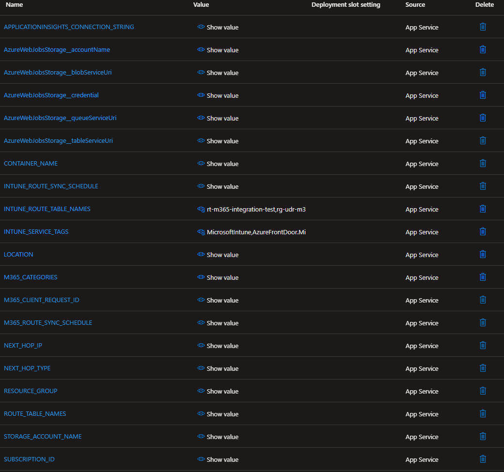
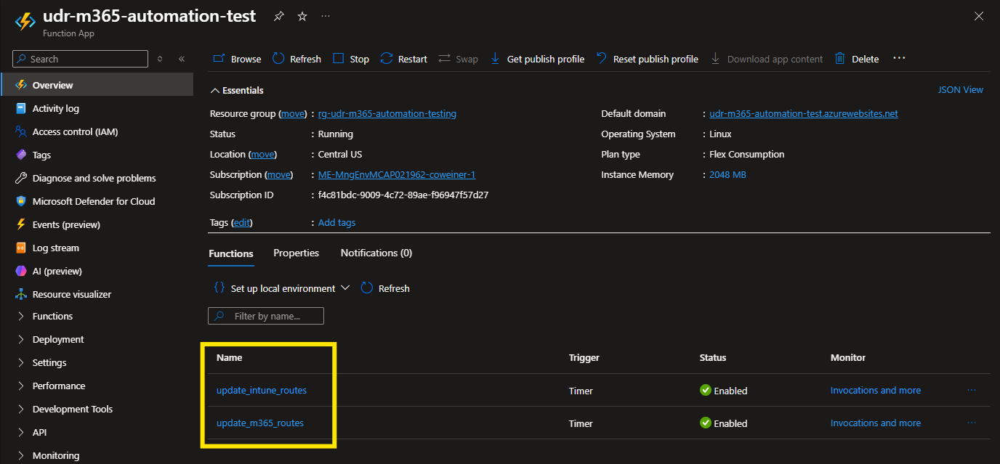
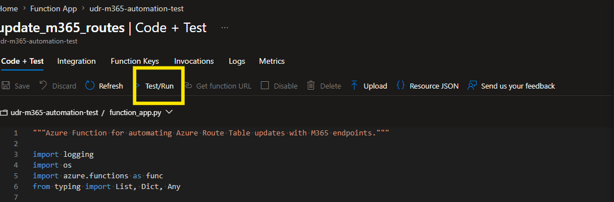
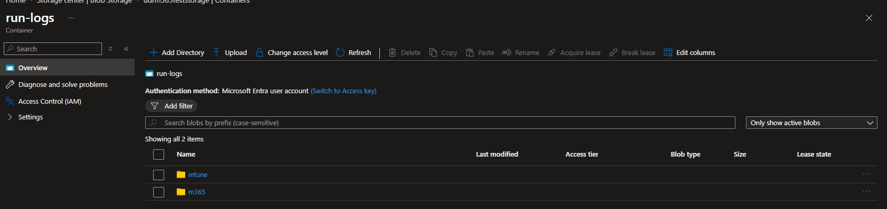

# Azure UDR M365 Automation

Keeps Azure Route Tables synchronized with Microsoft 365 IP ranges so M365 traffic (Teams, Exchange, SharePoint) bypasses your security appliance and routes directly to the internet — automatically, daily.

**How it works:** An Azure Function fetches the [M365 endpoint API](https://learn.microsoft.com/en-us/microsoft-365/enterprise/microsoft-365-ip-web-service) daily, diffs the results against saved state, and adds/removes UDRs in your route tables. It also detects and restores routes that were manually deleted (drift detection). All runs are logged as JSON blobs in Azure Storage for audit.

The same Function App includes a second timer (`update_intune_routes`) that does the same for Intune traffic, using a hardcoded IPv4 CIDR list sourced from Microsoft's [Intune consolidated endpoint list](https://learn.microsoft.com/en-us/mem/intune/fundamentals/intune-endpoints). The list is maintained in `shared/intune_api.py` and includes a `LAST_VERIFIED` date and source commit reference. A daily doc-version check (built into the Intune sync run) monitors the Microsoft docs repo for changes and logs a warning if an update is detected, prompting a list review and redeploy.

> **Intune FQDN limitation:** UDRs route by IP only. Intune endpoints such as `*.manage.microsoft.com` and `*.dm.microsoft.com` are FQDN-only and have no IP representation — they are not covered by UDRs. Configure Zscaler bypass (passthrough, not inspection) rules for those FQDNs separately. Together, UDRs for IPs and Zscaler bypass for FQDNs provide complete Intune traffic breakout.

> **When NOT to use this:** If your security appliance supports FQDN/URL-based filtering (e.g., Zscaler URL policies), that is the preferred Microsoft approach. Use UDR-based routing only when IP-based routing is required.

---

## Table of Contents

- [Why these routes?](#why-these-routes)
- [Prerequisites](#prerequisites)
  - [Azure RBAC Requirements](#azure-rbac-requirements)
- [Deploy](#deploy)
  - [Using deploy.ps1 (recommended)](#using-deployps1-recommended)
  - [Manual steps](#manual-steps)
  - [1. Clone the repo and set your subscription](#1-clone-the-repo-and-set-your-subscription)
  - [2. Configure parameters](#2-configure-parameters)
  - [3. Provision infrastructure](#3-provision-infrastructure)
  - [3a. Assign Network Contributor on additional resource groups](#3a-assign-network-contributor-on-additional-resource-groups)
  - [4. Deploy function code](#4-deploy-function-code)
  - [5. Verify](#5-verify)
- [Upgrading an existing M365-only deployment](#upgrading-an-existing-m365-only-deployment)
- [Schedule configuration](#schedule-configuration)
- [Trigger manually](#trigger-manually)
- [Run logs](#run-logs)
- [Troubleshooting](#troubleshooting)
- [Customer onboarding](#customer-onboarding)
- [References](#references)
- [License](#license)

---

## Why these routes?

### M365

Microsoft classifies M365 network traffic into [three categories](https://learn.microsoft.com/en-us/microsoft-365/enterprise/microsoft-365-network-connectivity-principles#new-office-365-endpoint-categories). This function defaults to `Optimize` + `Allow`:

| Category | What it covers | Route it direct? |
|----------|---------------|-----------------|
| **Optimize** | Most latency-sensitive M365 traffic (Teams media, core Exchange/SharePoint). Microsoft says these should avoid proxy inspection. | **Yes** |
| **Allow** | Additional Exchange/SharePoint/OneDrive endpoints. Lower sensitivity than Optimize, but still recommended for direct routing. | **Yes** |
| **Default** | Broad Microsoft CDN/telemetry/cloud traffic outside core M365 breakout needs. | No |

The full list of IPs per category is published at [Microsoft 365 URLs and IP address ranges](https://learn.microsoft.com/en-us/microsoft-365/enterprise/urls-and-ip-address-ranges?view=o365-worldwide).

**Why not `Default`?** It is too broad and would bypass too much inspection. `Optimize` + `Allow` is the targeted set (about 34 routes, subject to change as Microsoft updates endpoints).

**Why UDRs?** With a [forced tunnel](https://learn.microsoft.com/en-us/azure/vpn-gateway/vpn-gateway-forced-tunneling-rm), M365 can hairpin through your NVA/VPN and add latency. UDRs with `nextHopType: Internet` provide local breakout only for those M365 CIDRs.

### Intune

The Intune IP list comes from the **"IP Subnets"** block in the [Intune consolidated endpoint list](https://learn.microsoft.com/en-us/mem/intune/fundamentals/intune-endpoints) (IPv4 only — IPv6 entries are excluded as Azure UDRs do not support IPv6 prefixes). The list covers the backend infrastructure Intune-enrolled devices communicate with: device management services, Windows Update for Business, Microsoft Defender for Endpoint, and related Microsoft cloud services.

**Why not Azure Service Tags?** The `MicrosoftIntune` and `AzureFrontDoor.MicrosoftSecurity` Service Tags return only a small subset of the documented Intune IPs (4 CIDRs in testing vs. 85 in the consolidated list). Using them would leave most Intune traffic routing through the NVA rather than breaking out directly, defeating the purpose.

**How the list stays current:** Microsoft does not publish a programmatic API for Intune IPs equivalent to the M365 endpoint service. Instead, the daily Intune sync fetches the raw `endpoints.md` file from the public [MicrosoftDocs/memdocs](https://github.com/MicrosoftDocs/memdocs) GitHub repo, compares its commit SHA against the last-known SHA stored in blob storage, and when a change is detected automatically re-parses all IPv4 CIDRs and writes the updated list to blob — no redeploy needed. If parsing fails (e.g. Microsoft restructures the page), the function falls back to the last successfully stored list, then to a hardcoded baseline in `shared/intune_api.py` as a last resort, and logs a warning in Application Insights.

---

## Prerequisites

- Azure subscription with permission to create resources and assign RBAC roles
- Azure CLI installed, or use [Azure Cloud Shell](https://shell.azure.com) (no local install required)
- The deployment resource group must exist before running `deploy.ps1`
- Route tables do **not** need to be pre-created — `deploy.ps1` creates any missing ones automatically across all resource groups listed in `routeTableNames`. The resource groups themselves must exist.

### Azure RBAC Requirements

Two sets of permissions are required: one for **deploying the solution** (your user account) and one for the **Function App's managed identity** at runtime.

#### Deploying the solution (your user account)

| Role | Scope | Purpose |
|------|-------|---------|
| **Contributor** (or Owner) | Subscription or Resource Group | Create the resource group, Function App, Storage Account, and App Service Plan |
| **User Access Administrator** (or Owner) | Subscription or Resource Group | Assign RBAC roles to the Function App's managed identity during Bicep deployment |

> **Tip:** Owner at the resource group level satisfies both rows. If your account only has Contributor, a separate Owner or User Access Administrator must run the Bicep deployment (or pre-create the role assignments manually).

#### Function App managed identity (runtime)

The Bicep template automatically assigns these roles to the Function App's **system-assigned managed identity**. No manual steps are needed if you deploy with sufficient permissions above.

If you manage route tables in additional resource groups (using `resourcegroup/tablename` entries in `routeTableNames`), you must manually assign **Network Contributor** on each of those resource groups after running Bicep. The Bicep template can only assign roles within the deployment resource group.

> **Why:** The Function App uses a system-assigned managed identity. This identity is created inside the function app's resource group and has no automatic access to other resource groups. It is also tied to the function app's lifecycle — if you delete and recreate the function app (e.g. to fix a broken deployment), a new identity with a new principal ID is created and these cross-RG role assignments must be re-applied.

See [3a. Assign Network Contributor on additional resource groups](#3a-assign-network-contributor-on-additional-resource-groups) for the exact command.

| Role | Scope | Purpose |
|------|-------|---------|
| **Network Contributor** | Resource Group | Read and update Route Tables (add/remove UDR entries) |
| **Storage Blob Data Contributor** | Storage Account | Read/write route-state blobs, run-log blobs, and the deployment package |
| **Storage Queue Data Contributor** | Storage Account | Supports Functions host storage interactions in Flex Consumption |
| **Storage Table Data Contributor** | Storage Account | Supports Functions host storage interactions in Flex Consumption |

Role assignments can be checked after infrastructure deployment in [Step 5. Verify](#5-verify).

---

## Deploy

> **Recommended: use `deploy.ps1`** — a single PowerShell script that runs the full sequence automatically. The manual steps below are provided for reference or for environments where the script can't be used (e.g. Azure Cloud Shell without PowerShell 7).

### Using deploy.ps1 (recommended)

`deploy.ps1` handles the complete deployment in one command — including creating any missing route tables across all resource groups. Run `Get-Help .\deploy.ps1` for full usage.

`deploy.ps1` requires a `-SubscriptionId` argument, verifies it matches `subscriptionId` in the parameters file, then sets Azure CLI context before running deployment commands.

If zip deployment is enabled (default), `deploy.ps1` now fails fast when `function.zip` is missing and prints the exact build commands, instead of failing after infrastructure steps complete.

```powershell
.\deploy.ps1 `
    -ParametersFile infra/main.testing.parameters.json `
    -ResourceGroup <resource-group> `
    -SubscriptionId <subscription-id>
```

Required arguments:

- `-ParametersFile` (required): Path to the parameters file for the target environment (for example `infra/main.testing.parameters.json` or `infra/main.prod.parameters.json`).
- `-ResourceGroup` (required): Deployment resource group where the Function App and supporting resources are created (for example `rg-udr-m365-automation-testing`).
- `-SubscriptionId` (required): Azure subscription ID. Must match `subscriptionId` in the parameters file.

Optional arguments:

- `-ZipPath`: Path to the deployment package (default: `function.zip` in the current directory).
- `-SkipZipDeploy`: Runs infrastructure/RBAC steps only and skips code package deployment.

For full parameter descriptions and examples, see [2. Configure parameters](#2-configure-parameters).

---

### Manual steps

#### 1. Clone the repo and set your subscription

```bash
git clone https://github.com/colinweiner111/azure-udr-m365-automation.git
cd azure-udr-m365-automation
az account set --subscription <subscription-id>
```

> **Caution:** The manual path depends on the currently selected Azure CLI context. Unlike `deploy.ps1`, it does not verify that your active subscription matches `subscriptionId` in the parameters file.

> **Caution:** The manual path also does not auto-create route tables. Ensure every table listed in `routeTableNames` already exists before running the Bicep deployment.

#### 2. Configure parameters

Open the parameters file in the Cloud Shell editor:

```bash
code infra/main.parameters.json
```

For separate environments, use dedicated parameter files:

```bash
code infra/main.testing.parameters.json
code infra/main.prod.parameters.json
code infra/main.customer.parameters.template.json
```

Use different values per environment for at least:

- `functionAppName`
- `storageAccountName`
- `routeTableNames`
- deployment resource group

This keeps test and production state/log data isolated.

For customer deployments, copy `infra/main.customer.parameters.template.json` to a customer-specific parameters file and fill in the customer subscription, region, function app name, storage account name, and all route tables.

| Parameter | Description | Required |
|-----------|-------------|----------|
| `subscriptionId` | Azure subscription ID | Yes |
| `functionAppName` | Function App name (becomes `<name>.azurewebsites.net`) — must be globally unique | Yes |
| `storageAccountName` | Storage account name (3–24 chars, lowercase + numbers, globally unique) | Yes |
| `routeTableNames` | Route tables to manage. Each entry is a bare table name (uses the deployment resource group) **or** a `resourcegroup/tablename` pair for tables in different resource groups within the same subscription. Examples: `rt-spoke1,rt-spoke2` (same RG) or `rg-spoke1/rt-spoke1,rg-spoke2/rt-spoke2` (different RGs) | Yes |
| `location` | Azure region (e.g., `centralus`) | Yes |
| `nextHopType` | `Internet` or `VirtualAppliance` | Default: `Internet` |
| `nextHopIp` | NVA private IP — required only when `nextHopType` is `VirtualAppliance` | Conditional |
| `containerName` | Blob container for route state | Default: `m365-routes` |
| `m365Categories` | M365 categories to include: `Optimize`, `Allow`, `Default` | Default: `Optimize,Allow` |
| `m365RouteSyncSchedule` | Timer schedule in UTC (NCRONTAB, 6 fields: `sec min hour day month day-of-week`) | Default: `0 0 0 * * *` |
| `intuneRouteTableNames` | Route tables to manage for Intune routes. Same format as `routeTableNames`. | Default: same as `routeTableNames` |
| `intuneRouteSyncSchedule` | Timer schedule for Intune sync in UTC (NCRONTAB, 6 fields). Offset from M365 to avoid overlap. | Default: `0 30 0 * * *` |

> **Parameter -> app setting mapping:** The Bicep deployment parameters map to Function App environment variables as follows: `routeTableNames` -> `ROUTE_TABLE_NAMES`, `containerName` -> `CONTAINER_NAME`, `m365Categories` -> `M365_CATEGORIES`, `m365RouteSyncSchedule` -> `M365_ROUTE_SYNC_SCHEDULE`, `intuneRouteTableNames` -> `INTUNE_ROUTE_TABLE_NAMES`, `intuneRouteSyncSchedule` -> `INTUNE_ROUTE_SYNC_SCHEDULE`.

> **Route table limit:** Azure caps each route table at 400 routes. M365 `Optimize,Allow` is typically ~34 routes; Intune adds ~85. Combined that's ~119 per table when both functions manage the same tables — well within the limit.

#### 3. Provision infrastructure

```bash
az group create --name <resource-group> --location <location>

# Pick one parameter file per deployment
# infra/main.testing.parameters.json or infra/main.prod.parameters.json
az deployment group create \
  --resource-group <resource-group> \
  --template-file infra/main.bicep \
  --parameters <parameters-file>
```

> Takes under 20 minutes. Azure Cloud Shell disconnects after 20 minutes of inactivity — the deployment completes well within that window.

Bicep creates: Storage Account, Blob containers, Flex Consumption Function App (Python 3.11, FC1) with System-Assigned Managed Identity, Application Insights, and all required RBAC role assignments (Network Contributor on the RG, Storage Blob/Queue/Table Data Contributor on the storage account).

For customer deployments with route tables in multiple resource groups, treat Network Contributor on every resource group listed in `routeTableNames` as mandatory for first-run success.

#### 3a. Assign Network Contributor on additional resource groups

Skip this step if all your route tables are in the deployment resource group.

If `routeTableNames` includes tables in other resource groups (`resourcegroup/tablename` format), assign Network Contributor on each of those RGs now. The managed identity does not have access to them automatically.

```bash
PRINCIPAL_ID=$(az functionapp show \
  --resource-group <resource-group> \
  --name <function-app-name> \
  --query identity.principalId -o tsv)

for RG in rg-dept01 rg-dept02 rg-dept03; do
  az role assignment create \
    --assignee-object-id $PRINCIPAL_ID \
    --assignee-principal-type ServicePrincipal \
    --role "Network Contributor" \
    --scope "/subscriptions/<subscription-id>/resourceGroups/$RG"
done
```

> **Note:** If using `deploy.ps1`, this step and the route table creation are handled automatically. The manual steps here are for reference only.

> **Important:** RBAC assignment propagation is not immediate. Wait at least 5 minutes before the first manual trigger or validation run.

#### 4. Deploy function code

Still in the same Cloud Shell session:

```bash
# Build zip (Linux-compiled packages required)
pip install --target .python_packages/lib/site-packages -r requirements.txt --platform manylinux2014_x86_64 --only-binary=:all:
zip -r function.zip . -x "*.git*" "local.settings.json" "__pycache__/*" "*.pyc" "tests.py" "infra/*"

# Deploy zip to Flex Consumption function app
az functionapp deployment source config-zip \
  --resource-group <resource-group> \
  --name <function-app-name> \
  --src function.zip
```

> **Cloud Shell note:** You may see pip dependency-resolver warnings related to preinstalled Cloud Shell packages. If the install command succeeds and `function.zip` is created, those warnings are typically non-blocking.

> Takes under a minute.

#### 5. Verify

```bash
az functionapp show --resource-group <resource-group> --name <function-app-name> --query state

az webapp log tail --resource-group <resource-group> --name <function-app-name>
```

To verify role assignments after deployment:

```bash
# Get the Function App's managed identity principal ID
PRINCIPAL_ID=$(az functionapp show \
  --resource-group <resource-group> \
  --name <function-app-name> \
  --query identity.principalId -o tsv)

# List all role assignments for that identity
az role assignment list \
  --assignee $PRINCIPAL_ID \
  --query "[].{Role:roleDefinitionName, Scope:scope}" \
  -o table
```

For a customer handoff, run one manual trigger after deployment and inspect the newest blob in the `run-logs` container. Do not treat the deployment as complete until every table in the run-log shows an empty `errors` array.

---

## Upgrading an existing M365-only deployment

If your Function App already runs `update_m365_routes`, adding Intune sync is an in-place upgrade — no new infrastructure required. The existing M365 function, state, and run logs are unaffected.

### Before you start

Verify the managed identity has **Network Contributor** on every resource group that contains an Intune target route table. If your Intune route tables are in different resource groups than your M365 ones, add the role assignment now:

```bash
PRINCIPAL_ID=$(az functionapp show \
  --resource-group <resource-group> \
  --name <function-app-name> \
  --query identity.principalId -o tsv)

az role assignment create \
  --assignee-object-id $PRINCIPAL_ID \
  --assignee-principal-type ServicePrincipal \
  --role "Network Contributor" \
  --scope "/subscriptions/<subscription-id>/resourceGroups/<intune-route-table-rg>"
```

> Wait at least 5 minutes after assigning the role before triggering the first Intune seed run.

### Safe upgrade sequence

**1. Deploy updated code**

```bash
pip install --target .python_packages/lib/site-packages -r requirements.txt --platform manylinux2014_x86_64 --only-binary=:all:
zip -r function.zip . -x "*.git*" "local.settings.json" "__pycache__/*" "*.pyc" "tests.py" "infra/*"

az functionapp deployment source config-zip \
  --resource-group <resource-group> \
  --name <function-app-name> \
  --src function.zip
```

**2. Verify both functions appear**

In the Azure Portal, open the Function App and confirm both `update_m365_routes` and `update_intune_routes` are listed under Functions. The M365 function will continue running on its existing schedule without interruption.

**3. Add Intune app settings**

In the portal: Function App → Settings → Environment variables → add:

| Setting | Value |
|---------|-------|
| `INTUNE_ROUTE_TABLE_NAMES` | Comma-separated list of route tables to manage for Intune. Same `rg/tablename` format as `ROUTE_TABLE_NAMES`. Can be the same tables or different ones. |
| `INTUNE_ROUTE_SYNC_SCHEDULE` | NCRONTAB schedule (6 fields). Recommend `0 30 0 * * *` (12:30 AM UTC) to avoid overlap with M365. |

Save and restart the Function App after adding the settings.

**4. Run the first Intune seed manually**

Trigger `update_intune_routes` from the portal or CLI (see [Trigger manually](#trigger-manually)). The first run seeds all Intune routes (~85 per table). With the batch PUT implementation this completes in under 10 seconds for 6 tables.

**5. Confirm success**

Check the newest `intune/` blob in the `run-logs` container and verify:

- `result` is `success`
- `add_succeeded` equals `total_routes × number_of_tables`
- `add_failed` is `0`
- every table under `tables` has an empty `errors` array

The deployment is complete once all tables confirm clean.

---

## Schedule configuration

Schedules are controlled by app settings. Defaults:

| App setting | Default | Function |
|---|---|---|
| `M365_ROUTE_SYNC_SCHEDULE` | `0 0 0 * * *` (midnight UTC) | `update_m365_routes` |
| `INTUNE_ROUTE_SYNC_SCHEDULE` | `0 30 0 * * *` (12:30 AM UTC) | `update_intune_routes` |

The Intune schedule is offset by 30 minutes to avoid overlapping ARM API calls with the M365 sync.

To change a run time without redeploying code: Function App -> Settings -> Environment variables -> update the relevant setting -> Save -> Restart.



---

## Trigger manually

**From the CLI:**

```bash
# M365 routes
az rest --method post \
  --uri "https://management.azure.com/subscriptions/<subscription-id>/resourceGroups/<resource-group>/providers/Microsoft.Web/sites/<function-app-name>/hostruntime/admin/functions/update_m365_routes/trigger?api-version=2024-04-01"

# Intune routes
az rest --method post \
  --uri "https://management.azure.com/subscriptions/<subscription-id>/resourceGroups/<resource-group>/providers/Microsoft.Web/sites/<function-app-name>/hostruntime/admin/functions/update_intune_routes/trigger?api-version=2024-04-01"
```

> **First-run note (Intune):** The initial Intune seed run adds ~85 routes per table in parallel across all configured tables. Expect it to take 2–3 minutes. After the first successful run, daily executions complete in seconds (no-change result). Check the `intune/` prefix in the `run-logs` container for a `result: "success"` log to confirm the seed completed.

**From the Azure Portal:**

1. Open your Function App in the Azure Portal and select the function name (`update_m365_routes` or `update_intune_routes`).



2. Open **Code + Test** and click **Test/Run**.



---

## Run logs

Each run writes a JSON blob to the `run-logs` container in your storage account, organized by service and date (`m365/YYYY/MM/DD/HH-MM-SS.json` for M365, `intune/YYYY/MM/DD/HH-MM-SS.json` for Intune). Browse them in Azure Storage Explorer or the portal.



Current log shape keeps summary counters at the top level and route-level details per table under `tables`.

```json
{
  "timestamp": "2026-04-23T01:03:20Z",
  "result": "success",
  "source_version": "2026033100",
  "total_routes": 34,
  "add_succeeded": 1,
  "add_failed": 0,
  "remove_succeeded": 0,
  "remove_failed": 0,
  "tables": {
    "rg-udr-m365-county-dept01-testing/rt-m365-county-dept01-test": {
      "missing_before_run": 1,
      "added": 1,
      "add_failed": 0,
      "added_routes": ["52.96.0.0/14"],
      "add_failed_routes": [],
      "removed": 0,
      "remove_failed": 0,
      "removed_routes": [],
      "remove_failed_routes": [],
      "errors": []
    }
  }
}
```

Quick checks after each run:

- `result` is `success` or `no_change`
- top-level counters (`add_succeeded`, `remove_succeeded`, etc.) look expected
- each managed table appears under `tables`
- route-level details are visible per table (`added_routes`, `removed_routes`, failure arrays)

---

## Troubleshooting

**Authentication error / routes not updating**
- Verify RBAC: `az role assignment list --assignee <principal-id> --query "[].{Role:roleDefinitionName, Scope:scope}" -o table`
- The function identity needs Network Contributor on the RG and Storage Blob Data Contributor on the storage account (Bicep assigns these automatically).

**`RoleAssignmentUpdateNotPermitted` during Bicep deployment**
- This usually indicates a stale/orphaned role assignment from an older Function App managed identity.
- Delete stale Function-App-related assignments for the old/deleted identity at the deployment resource group scope (`Network Contributor`) and storage account scope (`Storage Blob/Queue/Table Data Contributor`), then rerun the infrastructure deployment.
- After infrastructure succeeds, run the zip deployment step again.

**Invalid route table name when using `resourcegroup/tablename`**
- Pull the latest repo version. Older template behavior could try to create a route table from the raw `routeTableNames` entry, which fails when the value includes `/`.
- Use `resourcegroup/tablename` for cross-resource-group tables; this is the expected format for runtime management.
- If deploying manually, pre-create every route table listed in `routeTableNames` before running Bicep.
- If deployment still fails at role assignments, this is an RBAC permission issue (not a route-table-name issue). Have an Owner or User Access Administrator run the Bicep deployment, or pre-create the required role assignments.

**Managed identity deleted or role assignments missing**
- If the Function App is re-created or its managed identity is deleted (e.g. by an Azure Policy cleanup job), the role assignments are orphaned and must be re-applied. Re-run the Bicep deployment — it will create a new identity and re-assign roles within the deployment resource group. Then re-run the cross-RG assignments from Step 3a for any additional resource groups. Orphaned assignments show up as `Unknown` principals in IAM and can be safely deleted.

**Function shows ServiceUnavailable after deploy**
- The zip hasn't been deployed yet.
- Run `az functionapp deployment source config-zip` as shown in Step 4.

**Routes were deleted and not restored**
- Drift detection runs on every execution. Trigger manually (see above) to restore immediately rather than waiting for the next daily run.

**Azure Policy wiping route tables**
- Policies with a `Modify` effect can overwrite route table properties. Exempt the resource group from those policies. The function will restore any removed routes on the next run (daily or manual trigger).

**Will the function remove my custom/non-M365 routes?**
- No. The function only manages routes whose address prefixes appear in its source list (M365 API or Intune hardcoded list). Any route you add manually (e.g. `0.0.0.0/0` pointing to a firewall) is invisible to the function and will never be modified or removed. The one exception: if a CIDR you added manually happens to match a prefix that Microsoft later drops from their published list, the function would remove it as part of normal cleanup.

**How does the Intune IP list stay current when Microsoft updates their endpoints?**
- Automatically. Each daily Intune sync checks the commit SHA of `endpoints.md` in the MicrosoftDocs/memdocs GitHub repo. If it changed, the function fetches the raw file, parses the IPv4 CIDRs, stores the updated list in blob storage (`m365-routes/doc-version/intune_cidrs.json`), and uses the new list immediately — no redeploy needed. Check Application Insights logs after a run to confirm: look for "Intune CIDR list auto-updated" with the before/after commit SHAs and the new CIDR count. If you see a warning about parse failure, it means Microsoft restructured the page in a way the regex could not handle — in that case, update `shared/intune_api.py` manually and redeploy to restore the hardcoded fallback.

---

## Customer onboarding

Use one Function App deployment per customer subscription.

- Keep each customer isolated to one subscription and one Function App.
- Use `ROUTE_TABLE_NAMES` only for route tables in that same subscription.
- For tables in other resource groups, grant the Function App managed identity `Network Contributor` on each resource group.
- Let customers update only operational app settings (for example `M365_ROUTE_SYNC_SCHEDULE`, `INTUNE_ROUTE_SYNC_SCHEDULE`, and `ROUTE_TABLE_NAMES`) in the portal.
- Keep the customer parameters file in source control and update it after any portal-only change so future redeployments stay in sync.

Customer handoff checklist:

- Confirm route tables exist and RBAC is assigned on every route-table resource group.
- Trigger `update_m365_routes` manually and verify the latest `m365/` run-log has no table-level errors.
- Trigger `update_intune_routes` manually. The first run is the initial seed (~2–3 minutes). Confirm the `intune/` run-log shows `result: "success"` and all tables have 0 errors before considering the deployment complete.
- Confirm `M365_ROUTE_SYNC_SCHEDULE` and `INTUNE_ROUTE_SYNC_SCHEDULE` are set to the agreed UTC schedules.

---

## References

- [Microsoft 365 IP Web Service](https://learn.microsoft.com/en-us/microsoft-365/enterprise/microsoft-365-ip-web-service)
- [M365 Endpoint Categories (Optimize / Allow / Default)](https://learn.microsoft.com/en-us/microsoft-365/enterprise/microsoft-365-network-connectivity-principles#identify-microsoft-365-network-traffic)
- [M365 Endpoints API — worldwide endpoints](https://endpoints.office.com/endpoints/worldwide?clientrequestid=b10c5ed1-bad1-445f-b386-b919946339a7) *(live JSON the function pulls)*
- [M365 Endpoints API — current version](https://endpoints.office.com/version/worldwide?clientrequestid=b10c5ed1-bad1-445f-b386-b919946339a7) *(version number used in run logs)*
- [Intune network endpoints (consolidated endpoint list)](https://learn.microsoft.com/en-us/mem/intune/fundamentals/intune-endpoints)
- [Azure Route Tables](https://learn.microsoft.com/en-us/azure/virtual-network/manage-route-table)
- [Azure Functions Python Developer Guide](https://learn.microsoft.com/en-us/azure/azure-functions/functions-reference-python)

## License

MIT
